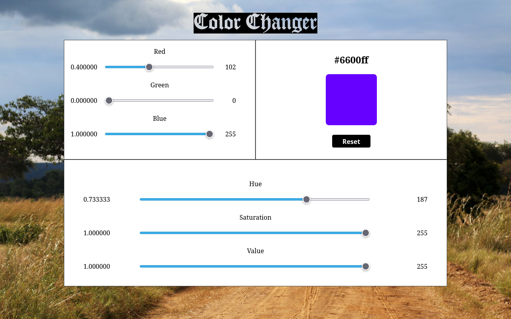

# Color Picker Utility

A simple browser-based color picker that allows you to adjust colors using RGB and HSV sliders.  
The selected color is displayed along with its hexadecimal RGB code, making it easy to copy and use in web design or development.  
It has a fancy *sabana*-changing background.



## Features
- Adjustable RGB and HSV sliders
- Real-time color preview
- Display of the hexadecimal RGB value
- Fancy changing *sabana* background with smooth transitions
- Works entirely in the browser — no server required

## Usage
1. Download or clone this repository:
   ```bash
   git clone https://github.com/yourusername/color-picker-utility.git
   ```
2. Open the `index.html` file in your preferred web browser.

That's it — you can now experiment with colors and get their exact hex codes!

## Contributing
Feel free to fork this repository, make improvements, and submit pull requests.  
All contributions must comply with the terms of the GNU General Public License v3.0.

## License
This project is licensed under the **GNU General Public License v3.0 (GPLv3)**.  
You are free to use, modify, and distribute this software, provided that all copies and derivative works are also licensed under the GPLv3.  
See the [LICENSE](./LICENSE) file for details.
